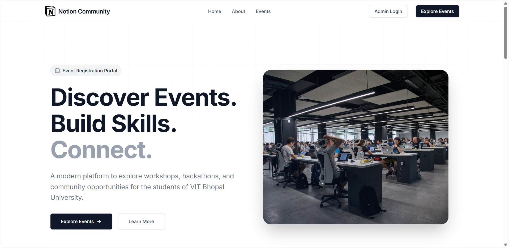
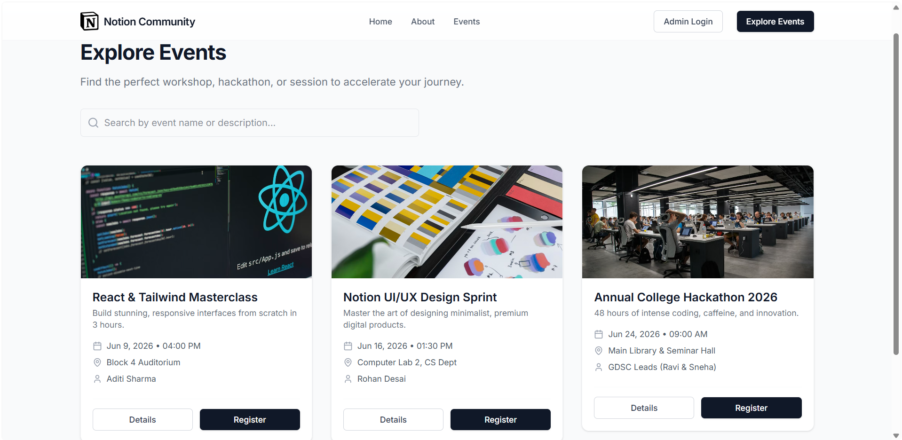
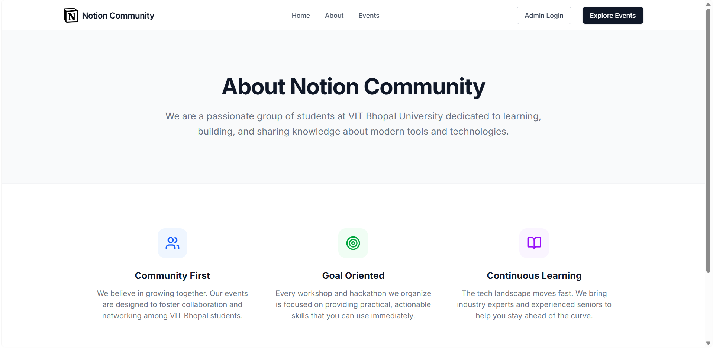
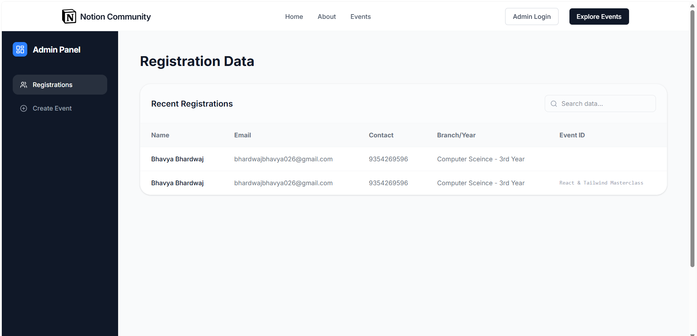
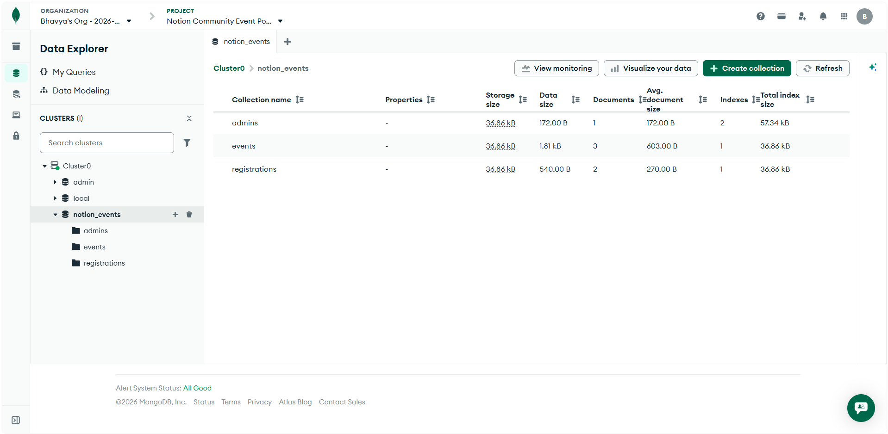
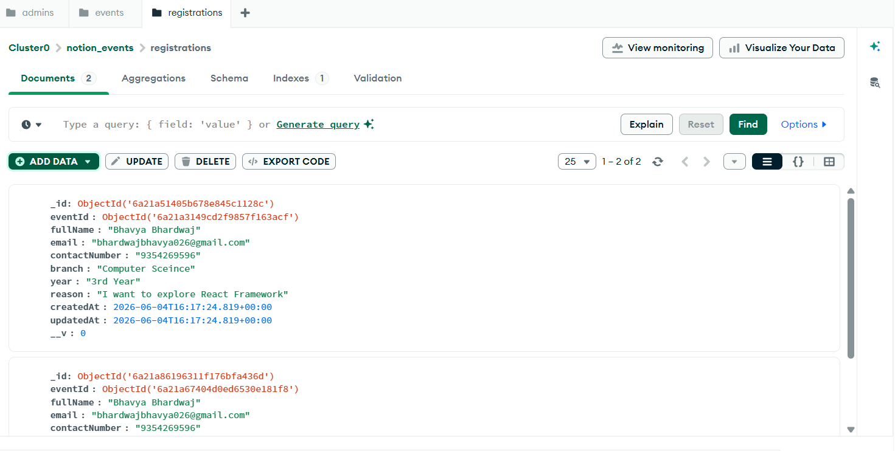

<div align="center">
  
  <h1>Notion Community @ VIT Bhopal</h1>
  <p><strong>The official event registration portal for Notion Community events at VIT Bhopal University.</strong></p>
  
  [](https://reactjs.org/)
  [](https://nodejs.org/)
  [](https://expressjs.com/)
  [](https://www.mongodb.com/)
  [](https://tailwindcss.com/)
</div>

<br />

> **IMPORTANT:**
> **Live Demo:** The project is already fully deployed and live at: **[https://notion-community-event-portal-front.vercel.app/](https://notion-community-event-portal-front.vercel.app/)**
> 
> *Note: The backend is hosted on Render's free tier, which goes to sleep after inactivity. It may take 30-50 seconds to spin up when you first visit the site. Please be patient!*
>
> **Admin Access:** To evaluate the admin dashboard on the live site, navigate to the `/admin` route and use the **Password:** `admin`

## About the Project

This is a full-stack web application designed to handle the end-to-end lifecycle of event registrations for the Notion Community at VIT Bhopal University. It provides a beautiful, modern frontend for students to discover events and register, alongside a secure backend and admin dashboard for the club to manage operations.

### Key Features

- **Dynamic Event Discovery:** Students can browse upcoming workshops, hackathons, and speaker sessions.
- **Frictionless Registration:** A clean, optimized registration form capturing student details (Name, Email, Branch, Year, Reason for joining).
- **Admin Dashboard:** A secured portal (`/admin`) for club administrators to view real-time registrations and publish new events dynamically.
- **Beautiful UI/UX:** Built with React, TailwindCSS, and Framer Motion for a premium, "Notion-like" user experience.
- **Robust Backend:** A Node.js/Express API connected to a MongoDB Atlas database for reliable data storage.

---

## Screenshots

### User Interface

| Hero Section | Events Page |
| :---: | :---: |
|  |  |

| About Section | Admin Dashboard |
| :---: | :---: |
|  |  |

### Database Architecture (MongoDB Atlas)

| Cluster View | Registrations Collection |
| :---: | :---: |
|  |  |

---

## Tech Stack

**Frontend:**
- React (Vite)
- TailwindCSS
- Framer Motion
- React Router DOM
- Axios

**Backend:**
- Node.js
- Express.js
- MongoDB & Mongoose
- JSON Web Tokens (JWT) for Admin Auth
- bcryptjs for password hashing

---

## Local Setup Instructions

> **NOTE:**
> The application is already fully deployed at **[https://notion-community-event-portal-front.vercel.app/](https://notion-community-event-portal-front.vercel.app/)**. These local setup instructions are provided purely for local testing and code evaluation purposes.

Follow these steps to run the project locally on your machine.

### Prerequisites
Make sure you have [Node.js](https://nodejs.org/) installed on your system.

### 1. Clone the repository
```bash
git clone https://github.com/bhavyabhardwaj001/notion-community-event-portal.git
cd notion-community-event-portal
```

### 2. Setup the Backend
Open a terminal and navigate to the backend directory:
```bash
cd backend
npm install
```

Create a `.env` file in the `backend` directory and add the following:
```env
PORT=5000
MONGO_URI=your_mongodb_connection_string
JWT_SECRET=your_super_secret_key
```

Start the backend server:
```bash
npm run dev
```

### 3. Setup the Frontend
Open a **new** terminal and navigate to the frontend directory:
```bash
cd frontend
npm install
```

Start the frontend development server:
```bash
npm run dev
```

The application will now be running at `http://localhost:5173`.

### 4. Access the Admin Portal

> **IMPORTANT:**
> **Admin Dashboard Credentials:**
> - URL: `http://localhost:5173/admin`
> **Password:** `admin`

---

## Author

**Built with heart by Bhavya Bhardwaj.**
<br />
VIT Bhopal University
